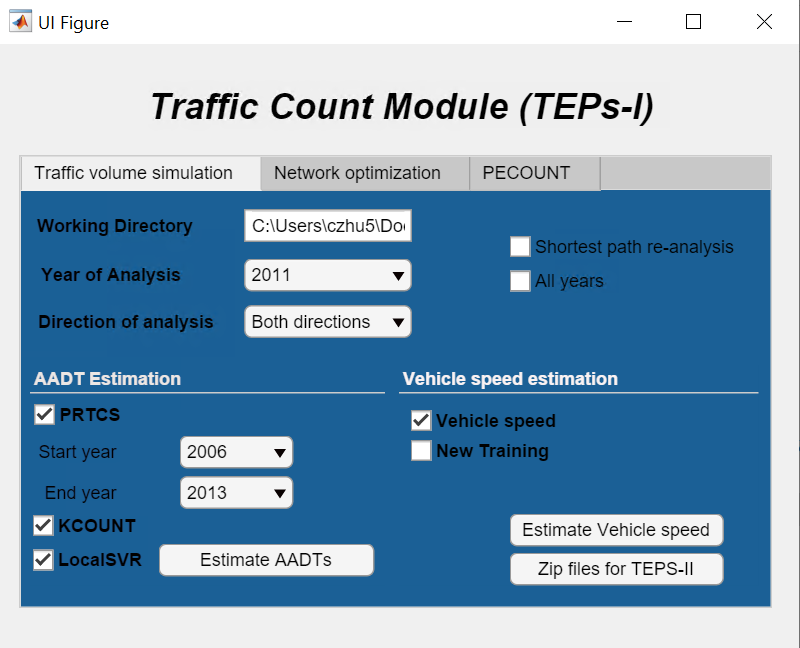
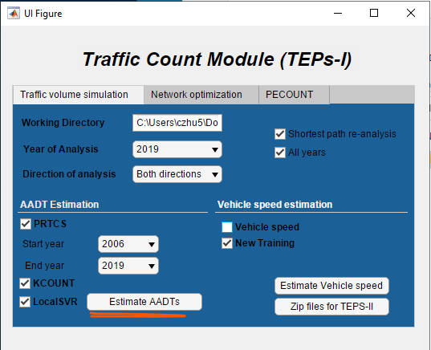
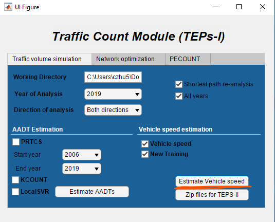

# Running TEPS

This is a guide for running the Traffic Emission Prediction Scheme (TEPS) by
Dr. Arman Ganji. For more information about the internal structure of TEPS, see
the [GitHub wiki](https://github.com/CityofToronto/bdit_traffic_prophet/wiki).
This tutorial is based off of GitHub issues [#4](
https://github.com/CityofToronto/bdit_traffic_prophet/issues/4), [#41](
https://github.com/CityofToronto/bdit_traffic_prophet/issues/41) and [#47](
https://github.com/CityofToronto/bdit_traffic_prophet/issues/47).

## TEPS Location

TEPS is stored in `\\trafic\Documents\BIG DATA\TEPS`. Refer to the README.md in
that folder for a file inventory.

For the purposes of running TEPS to update Energy and Environment Division (EED)
annual GHG inventories, we should copy `TEPS-I-EEDRun` to a local drive. This
folder is (somewhat unnecessarily) 50 GB in size, so it's recommended to do this
outside work hours.

## TEPS-I Structure

TEPS-I has four modules of relevance:

- PRTCS - Bagheri et al. 2014 algorithm for obtaining AADTs from a collection of
  short-term counts (each of a few days to weeks).
- KCOUNT - kriging to estimate AADT for arterial and collector roads without any
  short-term counts.
- LocalSVR - support vector regression to estimate AADT on local roads.
- Vehicle speed estimator - neural network to estimate vehicle cruising speed
  based on AADT and land use.

It also has two modules that are not typically used in our workflow:
- PECOUNT - AFRIMA algorithm for interpolating timeseries with gaps.
- OptimStation - network optimization to propose locations for new traffic
  counts.

## Running TEPS for Citywide AADT

Typically our team runs TEPS to generate citywide AADT on streets, and
corresponding cruising speeds. These two, combined with the length of street
segments, are sufficient to estimate the citywide greenhouse gas emission
inventory in TEPS-II.

1. To begin, we need to generate zip files of traffic counts that can be read in
   by TEPS. See the `Convert Postgres Data to Zips.ipynb` notebook for code to
   do this. Directionality is encoded as `+1/-1` in these files.

2. Place the zip files in `PRTCS/negative` for `-1` counts, and `PRTCS/positive`
   for `+1` counts.

3. Run the executable for TEPS, `TEPs_I.exe`, is located in its root directory.
   You'll be met with a screen like:

   

   Here:
     - `Working Directory` - should be the folder `TEPs_I.exe` is in.
     - `Year of Analysis` - year to produce AADTs. Ignored if the `All years`
       box is checked, in which case AADTs are generated for all years.
     - `Direction of analysis` - analyze one or both directions.
     - `Shortest path re-analysis` - only needed if new centreline segments are
       added to the network TEPS uses.
     - `PRTCS`, `KCOUNT`, and `LocalSVR` boxes - check to run the algorithms for
       AADT estimation (typically we check all of them).
       - `Start year` - first year of data to use for `PRTCS`.
       - `End year` - last year (inclusive) of data to use for `PRTCS`.
         Typically we set these to be 2006 and the last year of available data,
         respectively.
     - `Vehicle speed` - estimate vehicle speeds once AADT estimation is
       complete.
     - `New Training` - re-train the neural network that estimates speeds from
       volumes.
    
    The `Network optimization` tab launches OptimStation, and `PECOUNT` launches
    PECOUNT. We rarely use either.

4. Set the following configuration, changing the `End year` of analysis to be
   the last year you have data:

   

   Then press `Estimate AADTs`

   This will generate AADT files in `aadt_output_files`, as well as dump several
   hundred figures to screen (feel free to close those).

5. To estimate vehicle speeds, *uncheck* `PRTCS`, `KCOUNT` and `LocalSVR`, and
   check `Vehicle speed` (you can also check `New Training`, though this
   shouldn't do anything unless Arman has sent new raw speed data to train the
   neural network against):

   

6. Finally, select `Zip files for TEPS-II`, and TEPS will generate a folder
   called `Emission`, zip it up, and dump the zip into `EED`.

   The `Emission` folder currently contains a lot of leftover files from TEPS's
   development and testing, and the speed estimation process also dumps
   additional files that are not eventually used in TEPS-II. At minimum TEPS-II
   requires:

   - `Emission/`
     - `inputs/`
       - `AM.csv`
       - `emme_200new.csv`
       - `eve.csv`
       - `gregnet1.mat`
       - `gregnet2b.mat`
       - `input_for_toronto_sim4_negative_{YEAR}.csv`
       - `input_new_AM.csv`
       - `mid.csv`
       - `output_new_AM.csv`
       - `pm.csv`
       - `predictors_200m.csv`
     - `outputs/`

    In the past, we have manually copied these files into a zip file to send to
    EED, mainly to reduce download times.